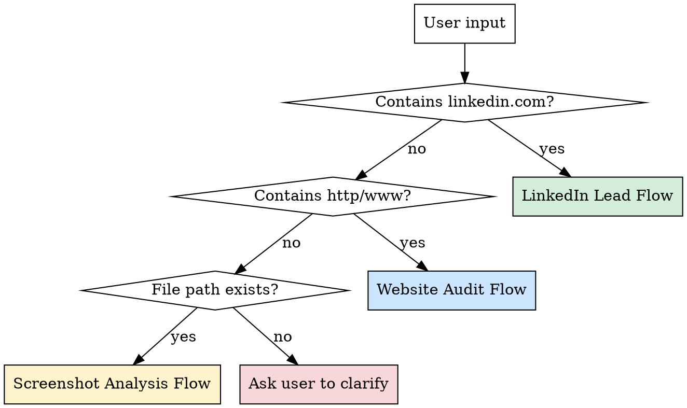

# /prospect — OHOS Lead Prospection

## Overview

Quickly add real estate agent leads and agency intel to the Notion CRM. Auto-detects input type and routes to the right workflow.

## Notion Database IDs

```
Leads:    collection://a5478c7d-401a-4061-8107-3593276c1086
Agences:  collection://097c637d-4ffd-492a-9a54-9902d81f3279
```

## Input Detection



## Flow 1: LinkedIn Lead

**Trigger:** URL contains `linkedin.com/in/`

**Steps:**
1. Ask the user for the lead's info visible on the LinkedIn page:
   - Full name
   - Job title / position
   - Agency name
   - City (if visible)
   - Email / phone (if visible)
   - Any personal notes
2. Search Agences database for existing agency (case-insensitive name match)
3. If agency not found → create new Agency record (Nom, Ville)
4. Create Lead record with:
   - Nom, Poste, LinkedIn URL, Email, Téléphone
   - Agence → relation to found/created agency
   - Statut → "Nouveau"
   - Notes perso → user's notes
5. Confirm to user with link to the Notion page

**Example:**
```
/prospect https://linkedin.com/in/jean-dupont-immo
> Jean Dupont, Directeur, Agence Riviera Prestige, Nice
> Notes: Portfolio villas Mougins, semble actif sur LinkedIn
```

## Flow 2: Website Audit

**Trigger:** URL not LinkedIn, contains http/https/www

**Steps:**
1. Use WebFetch to load the agency website
2. Analyze for these criteria:
   - **Mobile responsive?** (viewport meta, responsive patterns)
   - **Loading speed** (heavy images, unoptimized assets)
   - **Property listings quality** (do all properties look identical?)
   - **Lead capture** (contact forms, CTAs, Calendly)
   - **SEO basics** (meta tags, structured data)
   - **Design quality** (modern vs dated, professional vs amateur)
3. Generate a score: Bon / Moyen / Mauvais
4. Search Agences for matching agency → update Audit site + Score site fields
5. If no matching agency, ask user which agency this belongs to (or create new)
6. List 3-5 specific problems that could be used as personalization hooks in cold emails

**Output format:**
```
🏢 Agence Riviera Prestige — Score: Mauvais
Problèmes détectés:
1. Site non responsive (pas de viewport meta)
2. Annonces toutes identiques (même template)
3. Pas de formulaire de contact visible
4. Images non optimisées (>2MB par photo)
→ Arguments email: "J'ai vu que vos annonces utilisent toutes le même format..."
```

## Flow 3: Screenshot Analysis

**Trigger:** Input is a file path (ends in .png, .jpg, .jpeg, .webp, .gif or path exists on disk)

**Steps:**
1. Read the image file using the Read tool (Claude Vision)
2. Analyze the screenshot for:
   - UI/UX problems visible
   - Broken layouts, overlapping elements
   - Poor typography, unreadable text
   - Missing or broken images
   - Dated design patterns
   - Property presentation quality
3. Ask user which agency this screenshot belongs to
4. Update the Agency record: append findings to Audit site field
5. Save screenshot path in Notes for reference

## Multi-Input Mode

User can provide multiple inputs at once. Process each in order:
```
/prospect
LinkedIn: https://linkedin.com/in/marie-martin
Site: https://riviera-prestige.fr
Screen: ~/Desktop/OH-OS/Screen site agence Immo/riviera-home.png
Notes: Rencontrée au salon MIPIM, très intéressée
```

## Quick Reference

| Field | Lead DB | Agency DB |
|-------|---------|-----------|
| Name | Nom (title) | Nom (title) |
| Position | Poste | — |
| LinkedIn | LinkedIn (url) | — |
| Email | Email | — |
| Phone | Téléphone | — |
| Website | — | Site web (url) |
| City | — | Ville (select) |
| Site audit | — | Audit site (text) |
| Site score | — | Score site (select) |
| Status | Statut (select) | — |
| Lemlist | Ajouté à Lemlist (checkbox) | — |
| Notes | Notes perso (text) | Notes (text) |
| Relation | Agence → Agency | Leads → Lead[] |

## Common Mistakes

- **Duplicate agencies:** Always search by name before creating. Normalize: trim, lowercase compare.
- **Missing relation:** Every lead MUST be linked to an agency. If unknown, create a placeholder "Agence inconnue" record.
- **Overwriting audit:** When updating Audit site, APPEND new findings with date, don't replace.
- **Ville options:** Must match exactly one of: Nice, Cannes, Antibes, Monaco, Mougins, Saint-Tropez, Lyon, Bordeaux, Pays Basque. If city not in list, leave empty and add to Notes.
